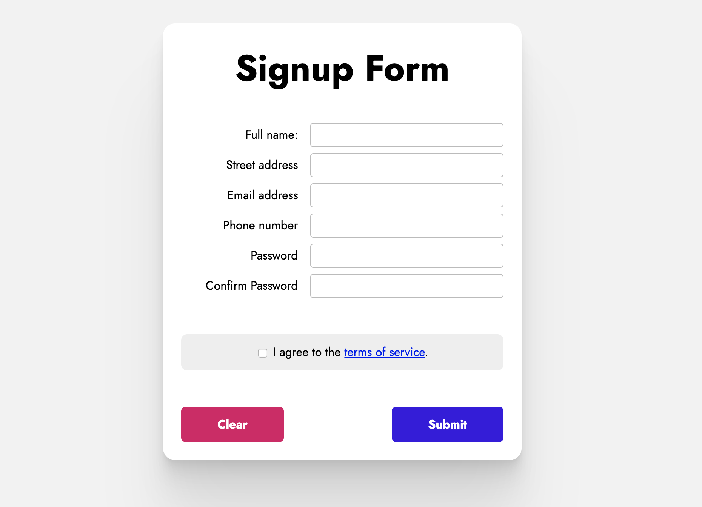
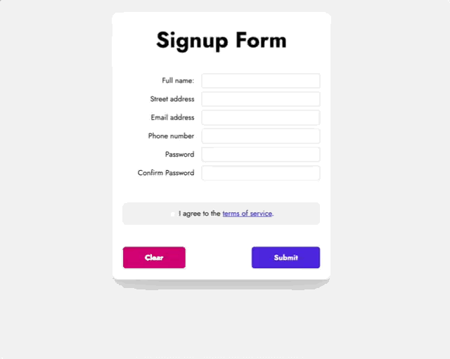
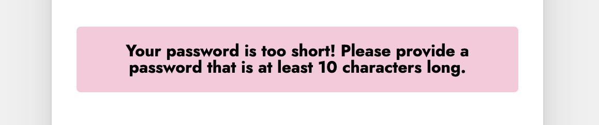
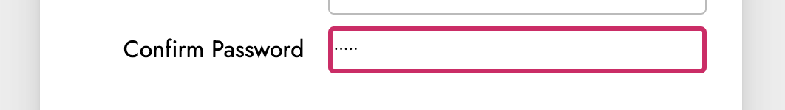
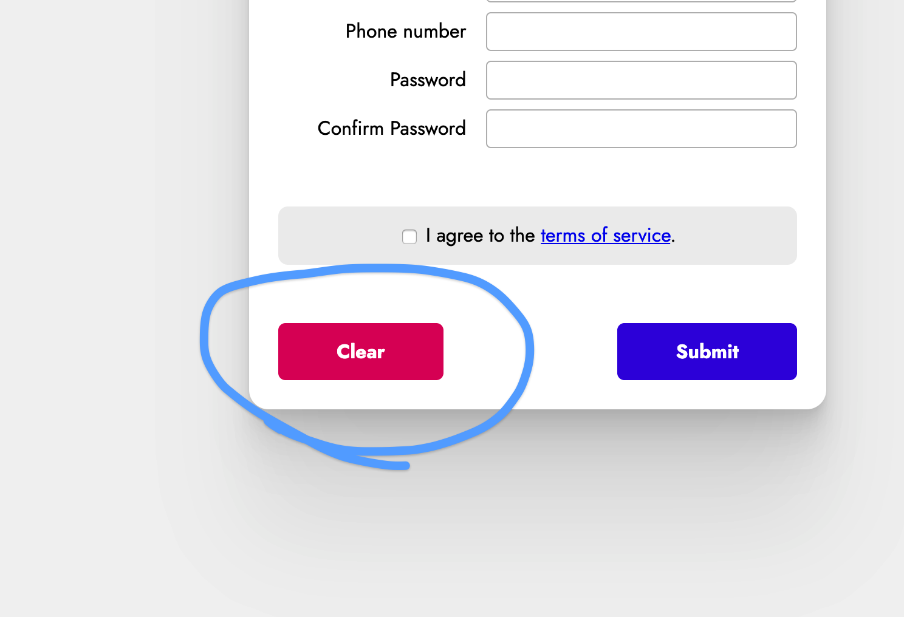

# Optional Mini Project: HTML Forms

In this project, you will be challenged to create a dynamic form.

Here's a screenshot:



Your challenge is to add **form validation**, to stop users from signing up with invalid input. Here's a clip:



✨ **Don't worry** ✨ - all of these requirements are laid out below.

# Getting started

Start by creating some starter files:

- `index.html`
- `style.css`
- `script.js`

You can grab an HTML skeleton from this URL:

https://joshwcomeau.com/snippets/html/html-skeleton

Start by creating all of the HTML components you'll need. Then, spend some time on styling. It doesn't have to be pixel-perfect, but it should be pretty close.

### Colors

Here are the colors you'll need:

- Clear button: `hsl(333deg, 100%, 44%)`
- Submit button: `hsl(256deg, 100%, 44%)`
- Page and "terms" background: `#f2f2f2`
- Error message background: `hsla(333deg, 100%, 44%, 0.25)`

### Fonts

The font used is `Jost`, from Google Fonts. You can use it by adding this to your HTML:

```html
<link
  href="https://fonts.googleapis.com/css?family=Jost:400,700&display=swap"
  rel="stylesheet"
/>
```

After your form looks pretty close, let's start adding the correct behaviours!

### Links

The "terms of service" text should be a link, but we can set the `href` to `""`. We don't need a separate page for the terms themselves.

# Behaviours

When the user submits the form, the following validations should take place:

### Basic validations

All fields are required. They should have at least 1 character. You can solve for this by adding the `required` attribute to the HTML inputs.

The email field needs to be a valid email. You can ensure that the browser validates this by using `type="email"`

### Terms validation

If the user tries to submit the form before agreeing to the terms of service, the browser should open a `window.alert` explaining to the user that they need to agree to the terms.

### Password validations

There are two rules for passwords:

- The password should be at least 10 characters long.
- The "password" and "confirm password" fields should match.

If either of these fails, a number of things should happen:

1. A pink error box should be shown. It should have a message about what the problem is and how to fix it:



2. The field in question that needs to be fixed should be given a red outline with a thicker border:



3. The field in question will be _focused_, indicated by a blue outline:


When you start typing, it will update this field.

### Success

If there are any of the above errors, the form should not be submitted.

If none of these errors occur, an alert should show with the word "Success!". In a real application, this would submit to a server, but for now we'll use `window.alert`.

# Implementation

How do we do all of this? It's mostly for you to figure out, but here are some tips:

1. You'll want to use the `submit` event on the form
2. `ev.preventDefault` is very useful to stop a form from submitting and erasing everything on the page!
3. You can tell what the user has entered in a text input by selecting that element (with `document.querySelector`) and checking the `value` property. For checkboxes, you can tell if it's checked with the `checked` property.
4. When there is a password error, you need to show a pink box. You can add this box directly in your `index.html`, but set it to `display: none`. When there is a password error, you can use `classList.add` to add a new class, and `innerText` to change the message.

# Stretch goals

Finished with the main task? Here are some additional objectives

### 1. Error clean-up

Let's imagine the following scenario:

1. The user enters a too-short password
2. The "password" field is given a red outline
3. The user fixes that error, and clicks "submit", except now their passwords don't match

We would expect that the error will "move" to the "confirm password" field, but by default, the original "password" field will keep the red border.

We need to clear all errors when the user submits the form. Write a new function, `clearErrors`, and call it when the form is submitted.

If there are new errors, they will be dealt with normally. This is to ensure "stale" errors get swept away.

### 2. Autocomplete

We can make our form much more usable by adding `autocomplete` attribute to our form. Go through and add the appropriate `autocomplete` values for the inputs in our form.

Learn more: https://developer.mozilla.org/en-US/docs/Web/HTML/Attributes/autocomplete

### 3. Clear button

You'll notice in the design, there's a "clear" button:



When the user clicks this button, it should empty all individual text inputs, and untick the "I agree to terms" box.

Use Javascript to make it so!

### 4. Password suggest

If the user enters a password which is too short, suggest a random password for them!

A good password should be quite long (25+ characters) and made up of words that are easy-to-remember. For example, 'eat-all-classroom-decisions' is a more secure password than 'w0g\$lgA5'. And I know which one I'd find easier to remember.

If the user's password is too short, suggest a random password for them:


You can do this by creating a big list of nouns, and selecting 4-5 of them at random. You can use `Math.random()` to get a random number between 0 and 1, and `Math.round()` to round a decimal number.
